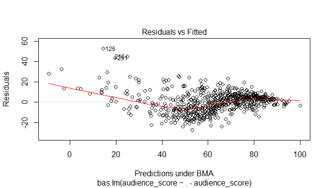
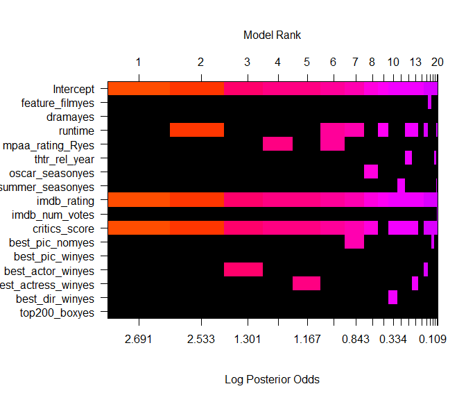
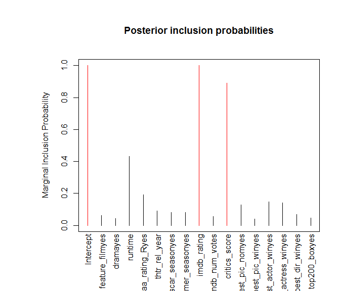

# Bayesian modeling and prediction for movies
Dale Richardson  
`r format(Sys.Date(), "%B %d, %Y")`  

## Setup

### Load packages


```r
suppressPackageStartupMessages(library(ggplot2))
suppressPackageStartupMessages(library(plotly))
suppressPackageStartupMessages(library(dplyr))
suppressPackageStartupMessages(library(statsr))
suppressPackageStartupMessages(library(BAS))
suppressPackageStartupMessages(library(MASS))
```

### Load data


```r
load("movies.Rdata")
```


* * *

## Part 1: Data
We have been provided a dataset of 651 **randomly sampled** movies produced and released prior to 2016. 
This dataset contains 32 variables, some of which will not be useful for statistical modeling (i.e. `imdb_url`). We have not been provided any further details as to how the movies were exactly randomly selected, so there may be some unknown bias present in the dataset (unlikely, but possible). We will assume that our findings based on this dataset will be generalizable to the population of movies produced and released prior to 2016 in the United States.

While the movies in this dataset have been selected randomly, it is **not possible to infer causality**. No random assignment into experimental/control groups was conducted regarding these movies. Therefore, we are unable to infer causality and instead can only highlight associations between variables.

* * *

## Part 2: Data manipulation

Below, I will create the variables as requested in the project rubric by using the `mutate` function
from `dplyr`. These variables are:

- `feature_film` with levels yes and no, based on `title_type`
- `drama` with levels yes and no, based on `genre`
- `mpaa_rating_R` with levels yes and no, based on `mpaa_rating`
- `oscar_season` with levels yes (if movie is released in November, October, or December) and no,
based on `thtr_rel_month`
- `summer_season` with levels yes (if movie is released in May, June, July, or August) and no, 
based on `thtr_rel_month`


```r
# use dplyr mutate function to create feature_film variable
movies <- movies %>% mutate(feature_film = ifelse(title_type == "Feature Film", "yes", "no") )
# convert to factor
movies$feature_film <- factor(movies$feature_film)

# create drama variable
movies <- movies %>% mutate(drama = ifelse(genre == "Drama", "yes", "no") )
# convert to factor
movies$drama <- factor(movies$drama)

# create mpaa_rating_R variable
movies <- movies %>% mutate(mpaa_rating_R = ifelse(mpaa_rating == "R", "yes", "no") )
# convert to factor
movies$mpaa_rating_R <- factor(movies$mpaa_rating_R)

# create oscar_season variable
movies <- movies %>% mutate(oscar_season = ifelse(thtr_rel_month %in% c(10,11,12), "yes", "no") )
# convert to factor
movies$oscar_season <- factor(movies$oscar_season)

# create summer_season variable
movies <- movies %>% mutate(summer_season = ifelse(thtr_rel_month %in% c(5:8), "yes", "no") )
# convert to factor
movies$summer_season <- factor(movies$summer_season)
```


* * *

## Part 3: Exploratory data analysis

Prior to exploring the data, I will first remove unnecessary variables from the dataframe, such as the `actor1-5` 
variables and the `url` variables. The `actor` variables denote the main actors/actresses in the adbridged cast of the movie, while the `url` variables indicate the Rotten Tomatoes or IMDB links for the movies. It is unlikely that either of these variables will be useful in the linear model.

### Data cleaning

```r
# drop useless variables
movies.clean <- movies %>% dplyr::select(-starts_with("actor"), -contains("url") )
# check that all is ok
str(movies.clean)
```

```
## Classes 'tbl_df', 'tbl' and 'data.frame':	651 obs. of  30 variables:
##  $ title           : chr  "Filly Brown" "The Dish" "Waiting for Guffman" "The Age of Innocence" ...
##  $ title_type      : Factor w/ 3 levels "Documentary",..: 2 2 2 2 2 1 2 2 1 2 ...
##  $ genre           : Factor w/ 11 levels "Action & Adventure",..: 6 6 4 6 7 5 6 6 5 6 ...
##  $ runtime         : num  80 101 84 139 90 78 142 93 88 119 ...
##  $ mpaa_rating     : Factor w/ 6 levels "G","NC-17","PG",..: 5 4 5 3 5 6 4 5 6 6 ...
##  $ studio          : Factor w/ 211 levels "20th Century Fox",..: 91 202 167 34 13 163 147 118 88 84 ...
##  $ thtr_rel_year   : num  2013 2001 1996 1993 2004 ...
##  $ thtr_rel_month  : num  4 3 8 10 9 1 1 11 9 3 ...
##  $ thtr_rel_day    : num  19 14 21 1 10 15 1 8 7 2 ...
##  $ dvd_rel_year    : num  2013 2001 2001 2001 2005 ...
##  $ dvd_rel_month   : num  7 8 8 11 4 4 2 3 1 8 ...
##  $ dvd_rel_day     : num  30 28 21 6 19 20 18 2 21 14 ...
##  $ imdb_rating     : num  5.5 7.3 7.6 7.2 5.1 7.8 7.2 5.5 7.5 6.6 ...
##  $ imdb_num_votes  : int  899 12285 22381 35096 2386 333 5016 2272 880 12496 ...
##  $ critics_rating  : Factor w/ 3 levels "Certified Fresh",..: 3 1 1 1 3 2 3 3 2 1 ...
##  $ critics_score   : num  45 96 91 80 33 91 57 17 90 83 ...
##  $ audience_rating : Factor w/ 2 levels "Spilled","Upright": 2 2 2 2 1 2 2 1 2 2 ...
##  $ audience_score  : num  73 81 91 76 27 86 76 47 89 66 ...
##  $ best_pic_nom    : Factor w/ 2 levels "no","yes": 1 1 1 1 1 1 1 1 1 1 ...
##  $ best_pic_win    : Factor w/ 2 levels "no","yes": 1 1 1 1 1 1 1 1 1 1 ...
##  $ best_actor_win  : Factor w/ 2 levels "no","yes": 1 1 1 2 1 1 1 2 1 1 ...
##  $ best_actress_win: Factor w/ 2 levels "no","yes": 1 1 1 1 1 1 1 1 1 1 ...
##  $ best_dir_win    : Factor w/ 2 levels "no","yes": 1 1 1 2 1 1 1 1 1 1 ...
##  $ top200_box      : Factor w/ 2 levels "no","yes": 1 1 1 1 1 1 1 1 1 1 ...
##  $ director        : chr  "Michael D. Olmos" "Rob Sitch" "Christopher Guest" "Martin Scorsese" ...
##  $ feature_film    : Factor w/ 2 levels "no","yes": 2 2 2 2 2 1 2 2 1 2 ...
##  $ drama           : Factor w/ 2 levels "no","yes": 2 2 1 2 1 1 2 2 1 2 ...
##  $ mpaa_rating_R   : Factor w/ 2 levels "no","yes": 2 1 2 1 2 1 1 2 1 1 ...
##  $ oscar_season    : Factor w/ 2 levels "no","yes": 1 1 1 2 1 1 1 2 1 1 ...
##  $ summer_season   : Factor w/ 2 levels "no","yes": 1 1 2 1 1 1 1 1 1 1 ...
```

```r
# which columns contain missing values, i.e. NA?
colnames(movies.clean)[colSums(is.na(movies.clean)) > 0]
```

```
## [1] "runtime"       "studio"        "dvd_rel_year"  "dvd_rel_month"
## [5] "dvd_rel_day"   "director"
```

Looks like we are missing 1 `runtime`, 8 `studio` and 8 `dvd_rel_year`, `dvd_rel_month` and `dvd_rel_day` and 2 `director`
observations. In principle, we could probably fill these data in by searching google but for the purposes of this assignment,
I will leave them as NAs. However, I will check which runtime is missing and see if I can insert it as I will probably use
this variable in my linear model.


```r
# which movie is missing the runtime?
movies.clean[which(is.na(movies$runtime)),]
```

```
## # A tibble: 1 × 30
##                title  title_type       genre runtime mpaa_rating  studio
##                <chr>      <fctr>      <fctr>   <dbl>      <fctr>  <fctr>
## 1 The End of America Documentary Documentary      NA     Unrated Indipix
## # ... with 24 more variables: thtr_rel_year <dbl>, thtr_rel_month <dbl>,
## #   thtr_rel_day <dbl>, dvd_rel_year <dbl>, dvd_rel_month <dbl>,
## #   dvd_rel_day <dbl>, imdb_rating <dbl>, imdb_num_votes <int>,
## #   critics_rating <fctr>, critics_score <dbl>, audience_rating <fctr>,
## #   audience_score <dbl>, best_pic_nom <fctr>, best_pic_win <fctr>,
## #   best_actor_win <fctr>, best_actress_win <fctr>, best_dir_win <fctr>,
## #   top200_box <fctr>, director <chr>, feature_film <fctr>, drama <fctr>,
## #   mpaa_rating_R <fctr>, oscar_season <fctr>, summer_season <fctr>
```

```r
# checking google for "The End of America Documentary", we find that the running time is 71 minutes. I will add this value as I may use this variable in my linear model
movies.clean$runtime[334] <- 71

# check that all ok
movies.clean[334,]
```

```
## # A tibble: 1 × 30
##                title  title_type       genre runtime mpaa_rating  studio
##                <chr>      <fctr>      <fctr>   <dbl>      <fctr>  <fctr>
## 1 The End of America Documentary Documentary      71     Unrated Indipix
## # ... with 24 more variables: thtr_rel_year <dbl>, thtr_rel_month <dbl>,
## #   thtr_rel_day <dbl>, dvd_rel_year <dbl>, dvd_rel_month <dbl>,
## #   dvd_rel_day <dbl>, imdb_rating <dbl>, imdb_num_votes <int>,
## #   critics_rating <fctr>, critics_score <dbl>, audience_rating <fctr>,
## #   audience_score <dbl>, best_pic_nom <fctr>, best_pic_win <fctr>,
## #   best_actor_win <fctr>, best_actress_win <fctr>, best_dir_win <fctr>,
## #   top200_box <fctr>, director <chr>, feature_film <fctr>, drama <fctr>,
## #   mpaa_rating_R <fctr>, oscar_season <fctr>, summer_season <fctr>
```

From the output above, we can see that the runtime for "The End of America Documentary" has been correctly inserted and we can proceed.

### Exploring how `audience_score` relates to the new variables we created

Given that we have created new categorical variables and we would like to see how the numerical variable, `audience_score`, relates to these categorical variables, boxplots are ideal. If one hovers over the boxplots below, you will see the corresponding 5-number summary values (Min, Q1, Median, Q3, Max) for each of the categorical variable's levels ("yes", "no"). This interactivity was achieved by using the `plotly` package, which you can find [here](https://plot.ly/r/). 

#### Non-feature films have higher audience scores than feature films

The plot below demonstrates a very strong relationship between `audience_score` and whether or not a movie is labeled as a feature film. Feature films have a lower median audience score (`62`) and a higher variance than non-feature films (median score `85.5`). The lower variance in the non-feature films could be due to a lower sample size (only 60 films) or because documentaries/non-feature films may adhere to higher standards. At this point, it is all speculative.


```r
# feature_film and audience_score
g <- ggplot(movies.clean, aes(x = feature_film, y = audience_score)) + geom_boxplot() + 
        labs(title = "Non-feature films have higher audience scores",
             x = "Feature Film", y = "Audience Score") +
        theme_bw()

ggplotly(g)
```

```
## Warning: We recommend that you use the dev version of ggplot2 with `ggplotly()`
## Install it with: `devtools::install_github('hadley/ggplot2')`
```

<!--html_preserve--><div id="bc043ba5dc8" style="width:480px;height:384px;" class="plotly html-widget"></div>
<script type="application/json" data-for="bc043ba5dc8">{"x":{"data":[{"x":[2,2,2,2,2,2,2,2,2,2,2,2,2,2,2,2,2,2,2,2,2,2,2,2,2,2,2,2,2,2,2,2,2,2,2,2,2,2,2,2,2,2,2,2,2,2,2,2,2,2,2,2,2,2,2,2,2,2,2,2,2,2,2,2,2,2,2,2,2,2,2,2,2,2,2,2,2,2,2,2,2,2,2,2,2,2,2,2,2,2,2,2,2,2,2,2,2,2,2,2,2,2,2,2,2,2,2,2,2,2,2,2,2,2,2,2,2,2,2,2,2,2,2,2,2,2,2,2,2,2,2,2,2,2,2,2,2,2,2,2,2,2,2,2,2,2,2,2,2,2,2,2,2,2,2,2,2,2,2,2,2,2,2,2,2,2,2,2,2,2,2,2,2,2,2,2,2,2,2,2,2,2,2,2,2,2,2,2,2,2,2,2,2,2,2,2,2,2,2,2,2,2,2,2,2,2,2,2,2,2,2,2,2,2,2,2,2,2,2,2,2,2,2,2,2,2,2,2,2,2,2,2,2,2,2,2,2,2,2,2,2,2,2,2,2,2,2,2,2,2,2,2,2,2,2,2,2,2,2,2,2,2,2,2,2,2,2,2,2,2,2,2,2,2,2,2,2,2,2,2,2,2,2,2,2,2,2,2,2,2,2,2,2,2,2,2,2,2,2,2,2,2,2,2,2,2,2,2,2,2,2,2,2,2,2,2,2,2,2,2,2,2,2,2,2,2,2,2,2,2,2,2,2,2,2,2,2,2,2,2,2,2,2,2,2,2,2,2,2,2,2,2,2,2,2,2,2,2,2,2,2,2,2,2,2,2,2,2,2,2,2,2,2,2,2,2,2,2,2,2,2,2,2,2,2,2,2,2,2,2,2,2,2,2,2,2,2,2,2,2,2,2,2,2,2,2,2,2,2,2,2,2,2,2,2,2,2,2,2,2,2,2,2,2,2,2,2,2,2,2,2,2,2,2,2,2,2,2,2,2,2,2,2,2,2,2,2,2,2,2,2,2,2,2,2,2,2,2,2,2,2,2,2,2,2,2,2,2,2,2,2,2,2,2,2,2,2,2,2,2,2,2,2,2,2,2,2,2,2,2,2,2,2,2,2,2,2,2,2,2,2,2,2,2,2,2,2,2,2,2,2,2,2,2,2,2,2,2,2,2,2,2,2,2,2,2,2,2,2,2,2,2,2,2,2,2,2,2,2,2,2,2,2,2,2,2,2,2,2,2,2,2,2,2,2,2,2,2,2,2,2,2,2,2,2,2,2,2,2,2,2,2,2,2,2,2,2,2,2,2,2,2,2,2,2,2,2,2,2,2,2,1,1,1,1,1,1,1,1,1,1,1,1,1,1,1,1,1,1,1,1,1,1,1,1,1,1,1,1,1,1,1,1,1,1,1,1,1,1,1,1,1,1,1,1,1,1,1,1,1,1,1,1,1,1,1,1,1,1,1,1],"y":[73,81,91,76,27,54,76,47,76,66,75,46,89,53,36,64,80,92,24,19,73,74,42,71,74,41,81,43,61,22,71,77,85,70,57,55,70,51,94,81,64,88,64,40,94,62,64,49,17,40,79,75,56,52,83,72,59,38,35,43,54,44,44,17,58,52,41,55,52,85,43,30,38,75,55,39,59,47,24,87,62,81,35,34,92,55,54,14,76,40,82,87,41,45,43,52,25,74,93,46,80,34,37,48,33,45,81,48,24,35,91,69,75,43,35,78,25,64,40,40,43,65,46,55,75,67,40,41,75,63,83,87,37,80,79,42,63,38,51,84,44,33,65,78,59,71,55,52,89,82,69,85,66,61,33,43,50,49,84,62,63,83,65,74,61,84,62,69,63,39,32,76,87,70,76,86,33,70,87,68,83,85,39,45,54,58,11,60,85,49,79,54,41,77,79,85,80,84,31,46,44,84,36,51,57,55,55,90,75,40,71,86,73,61,89,70,56,56,91,81,89,65,41,49,83,90,31,45,77,48,45,58,63,27,85,86,83,50,61,78,83,51,40,69,66,52,75,57,38,49,66,35,81,61,19,46,64,86,78,74,33,51,81,55,90,85,81,90,50,51,87,60,87,84,86,71,82,73,59,76,45,63,29,72,40,76,30,71,42,88,85,47,51,66,55,85,42,74,79,64,48,23,61,66,80,79,49,59,86,48,58,28,31,87,68,47,37,83,83,74,79,29,78,27,76,64,41,35,78,72,66,37,82,47,63,24,56,62,46,38,92,72,82,49,72,29,70,29,14,34,79,97,84,28,44,68,61,81,58,65,49,23,57,40,60,63,85,79,79,53,65,58,86,95,33,87,17,89,25,55,85,84,38,94,70,86,68,18,76,43,62,36,53,89,74,78,71,82,65,91,44,56,45,70,89,35,13,76,68,49,63,60,44,52,50,78,71,35,29,31,47,31,42,49,69,67,65,43,37,15,55,52,75,49,74,58,65,67,60,87,57,37,80,79,67,44,49,51,71,39,82,63,32,67,85,39,89,93,24,57,82,77,80,72,72,78,29,59,94,32,70,30,35,73,87,37,92,76,50,70,72,66,38,70,81,66,52,49,46,77,86,38,46,70,34,59,73,50,62,65,80,71,26,73,45,35,78,28,54,76,77,81,72,73,60,49,36,59,49,67,59,49,65,64,68,64,19,93,34,69,31,61,37,86,87,44,89,41,46,77,80,34,81,78,44,65,55,72,48,81,73,22,49,86,82,67,87,51,71,89,44,22,35,52,69,32,26,73,88,95,87,37,70,81,62,88,79,33,79,68,54,40,55,52,53,35,74,80,55,81,35,89,74,77,89,88,81,93,68,86,78,72,75,96,79,92,75,90,86,85,84,89,72,88,89,72,92,86,89,80,77,91,92,78,87,78,86,88,87,71,71,94,80,19,72,85,90,82,21,86,89,81,89,88,83,72,87,91,73,70,91],"type":"box","hoverinfo":"y","fillcolor":"rgba(255,255,255,1)","marker":{"opacity":null,"outliercolor":"rgba(0,0,0,1)","line":{"width":1.88976377952756,"color":"rgba(0,0,0,1)"},"size":5.66929133858268},"line":{"color":"rgba(51,51,51,1)","width":1.88976377952756},"showlegend":false,"xaxis":"x","yaxis":"y","frame":null}],"layout":{"margin":{"t":42.6905111055474,"r":7.30593607305936,"b":39.1106024297483,"l":43.1050228310502},"plot_bgcolor":"rgba(255,255,255,1)","paper_bgcolor":"rgba(255,255,255,1)","font":{"color":"rgba(0,0,0,1)","family":"","size":14.6118721461187},"title":"Non-feature films have higher audience scores","titlefont":{"color":"rgba(0,0,0,1)","family":"","size":17.5342465753425},"xaxis":{"domain":[0,1],"type":"linear","autorange":false,"tickmode":"array","range":[0.4,2.6],"ticktext":["no","yes"],"tickvals":[1,2],"ticks":"outside","tickcolor":"rgba(51,51,51,1)","ticklen":3.65296803652968,"tickwidth":0.66417600664176,"showticklabels":true,"tickfont":{"color":"rgba(77,77,77,1)","family":"","size":11.689497716895},"tickangle":-0,"showline":false,"linecolor":null,"linewidth":0,"showgrid":true,"gridcolor":"rgba(235,235,235,1)","gridwidth":0.66417600664176,"zeroline":false,"anchor":"y","title":"Feature Film","titlefont":{"color":"rgba(0,0,0,1)","family":"","size":14.6118721461187},"hoverformat":".2f"},"yaxis":{"domain":[0,1],"type":"linear","autorange":false,"tickmode":"array","range":[6.7,101.3],"ticktext":["25","50","75","100"],"tickvals":[25,50,75,100],"ticks":"outside","tickcolor":"rgba(51,51,51,1)","ticklen":3.65296803652968,"tickwidth":0.66417600664176,"showticklabels":true,"tickfont":{"color":"rgba(77,77,77,1)","family":"","size":11.689497716895},"tickangle":-0,"showline":false,"linecolor":null,"linewidth":0,"showgrid":true,"gridcolor":"rgba(235,235,235,1)","gridwidth":0.66417600664176,"zeroline":false,"anchor":"x","title":"Audience Score","titlefont":{"color":"rgba(0,0,0,1)","family":"","size":14.6118721461187},"hoverformat":".2f"},"shapes":[{"type":"rect","fillcolor":"transparent","line":{"color":"rgba(51,51,51,1)","width":0.66417600664176,"linetype":"solid"},"yref":"paper","xref":"paper","x0":0,"x1":1,"y0":0,"y1":1}],"showlegend":false,"legend":{"bgcolor":"rgba(255,255,255,1)","bordercolor":"transparent","borderwidth":1.88976377952756,"font":{"color":"rgba(0,0,0,1)","family":"","size":11.689497716895}},"hovermode":"closest"},"source":"A","attrs":{"bc060652c4b":{"x":{},"y":{},"type":"ggplotly"}},"cur_data":"bc060652c4b","visdat":{"bc060652c4b":["function (y) ","x"]},"config":{"modeBarButtonsToAdd":[{"name":"Collaborate","icon":{"width":1000,"ascent":500,"descent":-50,"path":"M487 375c7-10 9-23 5-36l-79-259c-3-12-11-23-22-31-11-8-22-12-35-12l-263 0c-15 0-29 5-43 15-13 10-23 23-28 37-5 13-5 25-1 37 0 0 0 3 1 7 1 5 1 8 1 11 0 2 0 4-1 6 0 3-1 5-1 6 1 2 2 4 3 6 1 2 2 4 4 6 2 3 4 5 5 7 5 7 9 16 13 26 4 10 7 19 9 26 0 2 0 5 0 9-1 4-1 6 0 8 0 2 2 5 4 8 3 3 5 5 5 7 4 6 8 15 12 26 4 11 7 19 7 26 1 1 0 4 0 9-1 4-1 7 0 8 1 2 3 5 6 8 4 4 6 6 6 7 4 5 8 13 13 24 4 11 7 20 7 28 1 1 0 4 0 7-1 3-1 6-1 7 0 2 1 4 3 6 1 1 3 4 5 6 2 3 3 5 5 6 1 2 3 5 4 9 2 3 3 7 5 10 1 3 2 6 4 10 2 4 4 7 6 9 2 3 4 5 7 7 3 2 7 3 11 3 3 0 8 0 13-1l0-1c7 2 12 2 14 2l218 0c14 0 25-5 32-16 8-10 10-23 6-37l-79-259c-7-22-13-37-20-43-7-7-19-10-37-10l-248 0c-5 0-9-2-11-5-2-3-2-7 0-12 4-13 18-20 41-20l264 0c5 0 10 2 16 5 5 3 8 6 10 11l85 282c2 5 2 10 2 17 7-3 13-7 17-13z m-304 0c-1-3-1-5 0-7 1-1 3-2 6-2l174 0c2 0 4 1 7 2 2 2 4 4 5 7l6 18c0 3 0 5-1 7-1 1-3 2-6 2l-173 0c-3 0-5-1-8-2-2-2-4-4-4-7z m-24-73c-1-3-1-5 0-7 2-2 3-2 6-2l174 0c2 0 5 0 7 2 3 2 4 4 5 7l6 18c1 2 0 5-1 6-1 2-3 3-5 3l-174 0c-3 0-5-1-7-3-3-1-4-4-5-6z"},"click":"function(gd) { \n        // is this being viewed in RStudio?\n        if (location.search == '?viewer_pane=1') {\n          alert('To learn about plotly for collaboration, visit:\\n https://cpsievert.github.io/plotly_book/plot-ly-for-collaboration.html');\n        } else {\n          window.open('https://cpsievert.github.io/plotly_book/plot-ly-for-collaboration.html', '_blank');\n        }\n      }"}],"cloud":false},"highlight":{"on":"plotly_click","persistent":false,"dynamic":false,"selectize":false,"opacityDim":0.2,"selected":{"opacity":1}},"base_url":"https://plot.ly"},"evals":["config.modeBarButtonsToAdd.0.click"],"jsHooks":{"render":[{"code":"function(el, x) { var ctConfig = crosstalk.var('plotlyCrosstalkOpts').set({\"on\":\"plotly_click\",\"persistent\":false,\"dynamic\":false,\"selectize\":false,\"opacityDim\":0.2,\"selected\":{\"opacity\":1}}); }","data":null}]}}</script><!--/html_preserve-->

```r
# how many non-feature films are there?
sum(movies.clean$feature_film == "no")
```

```
## [1] 60
```

#### Dramas have higher audience scores than other genres

The plot below indicates that dramas (`70`) have slightly higher median audience scores than non-dramas (`61`). In contrast to the above plot, the variances are much more homoskedastic. 


```r
# drama and audience_score
g <- ggplot(movies.clean, aes(x = drama, y = audience_score)) + geom_boxplot() + 
        labs(title = "Dramas have higher audience scores",
             x = "Drama", y = "Audience Score") +
        theme_bw()

ggplotly(g)
```

```
## Warning: We recommend that you use the dev version of ggplot2 with `ggplotly()`
## Install it with: `devtools::install_github('hadley/ggplot2')`
```

<!--html_preserve--><div id="bc03605c83" style="width:480px;height:384px;" class="plotly html-widget"></div>
<script type="application/json" data-for="bc03605c83">{"x":{"data":[{"x":[2,2,2,2,2,2,2,2,2,2,2,2,2,2,2,2,2,2,2,2,2,2,2,2,2,2,2,2,2,2,2,2,2,2,2,2,2,2,2,2,2,2,2,2,2,2,2,2,2,2,2,2,2,2,2,2,2,2,2,2,2,2,2,2,2,2,2,2,2,2,2,2,2,2,2,2,2,2,2,2,2,2,2,2,2,2,2,2,2,2,2,2,2,2,2,2,2,2,2,2,2,2,2,2,2,2,2,2,2,2,2,2,2,2,2,2,2,2,2,2,2,2,2,2,2,2,2,2,2,2,2,2,2,2,2,2,2,2,2,2,2,2,2,2,2,2,2,2,2,2,2,2,2,2,2,2,2,2,2,2,2,2,2,2,2,2,2,2,2,2,2,2,2,2,2,2,2,2,2,2,2,2,2,2,2,2,2,2,2,2,2,2,2,2,2,2,2,2,2,2,2,2,2,2,2,2,2,2,2,2,2,2,2,2,2,2,2,2,2,2,2,2,2,2,2,2,2,2,2,2,2,2,2,2,2,2,2,2,2,2,2,2,2,2,2,2,2,2,2,2,2,2,2,2,2,2,2,2,2,2,2,2,2,2,2,2,2,2,2,2,2,2,2,2,2,2,2,2,2,2,2,2,2,2,2,2,2,2,2,2,2,2,2,2,2,2,2,2,2,2,2,2,2,2,2,1,1,1,1,1,1,1,1,1,1,1,1,1,1,1,1,1,1,1,1,1,1,1,1,1,1,1,1,1,1,1,1,1,1,1,1,1,1,1,1,1,1,1,1,1,1,1,1,1,1,1,1,1,1,1,1,1,1,1,1,1,1,1,1,1,1,1,1,1,1,1,1,1,1,1,1,1,1,1,1,1,1,1,1,1,1,1,1,1,1,1,1,1,1,1,1,1,1,1,1,1,1,1,1,1,1,1,1,1,1,1,1,1,1,1,1,1,1,1,1,1,1,1,1,1,1,1,1,1,1,1,1,1,1,1,1,1,1,1,1,1,1,1,1,1,1,1,1,1,1,1,1,1,1,1,1,1,1,1,1,1,1,1,1,1,1,1,1,1,1,1,1,1,1,1,1,1,1,1,1,1,1,1,1,1,1,1,1,1,1,1,1,1,1,1,1,1,1,1,1,1,1,1,1,1,1,1,1,1,1,1,1,1,1,1,1,1,1,1,1,1,1,1,1,1,1,1,1,1,1,1,1,1,1,1,1,1,1,1,1,1,1,1,1,1,1,1,1,1,1,1,1,1,1,1,1,1,1,1,1,1,1,1,1,1,1,1,1,1,1,1,1,1,1,1,1,1,1,1,1,1,1,1,1,1,1,1,1,1,1,1,1,1,1,1,1,1,1,1,1,1,1,1,1,1,1,1,1,1,1,1,1,1,1,1,1,1,1,1,1,1,1,1,1,1,1,1,1,1,1,1,1,1,1,1,1,1,1,1,1,1,1,1,1,1,1],"y":[73,81,52,76,69,40,76,47,76,66,87,46,80,79,42,64,80,92,84,19,73,74,42,71,71,90,81,89,82,60,87,84,61,71,82,50,70,51,62,81,64,88,64,61,94,62,64,49,17,40,79,75,70,52,83,72,59,38,77,83,85,44,44,17,58,59,60,85,52,85,43,41,77,79,85,39,87,47,35,87,83,65,76,57,92,55,54,14,76,37,82,85,61,24,43,52,25,38,87,89,80,34,37,86,90,45,81,48,79,45,73,69,75,85,76,78,58,61,78,40,43,83,46,55,75,84,57,86,75,66,75,81,61,87,46,64,19,70,55,78,42,33,55,78,59,49,76,52,62,87,73,89,74,86,59,49,83,59,84,56,63,78,89,74,13,55,71,42,63,40,58,76,66,73,76,46,33,56,80,64,80,49,66,45,79,86,76,86,77,49,79,54,87,68,92,67,83,78,31,76,44,57,81,60,64,52,35,90,75,65,66,87,34,89,71,70,62,86,80,82,71,72,49,49,83,86,31,14,43,81,35,82,63,27,78,72,55,81,65,74,83,64,29,26,66,93,76,79,38,72,67,44,51,88,89,55,53,74,77,60,37,67,89,70,90,91,72,41,81,77,72,75,49,51,68,78,65,69,46,70,49,81,79,74,68,79,86,80,87,61,94,35,93,62,95,57,79,71,58,73,72,74,28,35,49,74,59,71,24,37,68,74,55,87,58,35,55,77,33,39,56,81,24,40,91,44,51,35,47,88,78,89,86,87,41,75,86,74,93,24,35,69,65,40,83,85,87,52,90,48,48,51,80,43,90,43,86,72,25,64,94,92,36,27,40,31,48,75,86,41,85,71,35,73,33,89,53,56,27,38,75,84,82,81,86,89,68,89,84,34,43,91,91,81,38,85,70,57,89,49,46,88,51,40,80,55,67,70,62,49,63,89,32,88,50,55,93,36,63,79,72,31,23,54,39,48,54,43,41,41,55,91,22,49,44,58,65,55,80,84,49,45,29,62,65,35,40,41,55,78,87,81,32,82,72,63,45,42,24,46,47,92,46,82,21,96,29,70,11,45,70,30,35,58,77,37,68,61,86,50,72,79,23,70,67,51,66,85,79,54,38,49,63,86,75,59,86,17,89,25,78,85,33,38,94,65,88,28,81,55,50,51,61,69,71,66,36,33,43,73,59,66,65,63,40,87,19,76,30,77,31,72,78,47,52,44,78,85,35,29,31,85,91,85,61,37,67,65,54,37,15,79,52,28,77,30,87,44,37,60,83,22,37,80,84,72,44,34,69,92,39,82,60,68,67,47,39,89,56,68,57,34,81,72,89,41,78,29,59,29,71,94,54,97,84,73,87,71,88,50,70,92,70,38,44,32,69,63,49,46,91,53,63,88,89,95,52,19,50,62,65,33,74,26,73,45,35,70,48,18,32,22,72,36,53,85,49,40,71,82,65,81,44,73,45,80,64,81,52,34,51],"type":"box","hoverinfo":"y","fillcolor":"rgba(255,255,255,1)","marker":{"opacity":null,"outliercolor":"rgba(0,0,0,1)","line":{"width":1.88976377952756,"color":"rgba(0,0,0,1)"},"size":5.66929133858268},"line":{"color":"rgba(51,51,51,1)","width":1.88976377952756},"showlegend":false,"xaxis":"x","yaxis":"y","frame":null}],"layout":{"margin":{"t":42.6905111055474,"r":7.30593607305936,"b":39.1106024297483,"l":43.1050228310502},"plot_bgcolor":"rgba(255,255,255,1)","paper_bgcolor":"rgba(255,255,255,1)","font":{"color":"rgba(0,0,0,1)","family":"","size":14.6118721461187},"title":"Dramas have higher audience scores","titlefont":{"color":"rgba(0,0,0,1)","family":"","size":17.5342465753425},"xaxis":{"domain":[0,1],"type":"linear","autorange":false,"tickmode":"array","range":[0.4,2.6],"ticktext":["no","yes"],"tickvals":[1,2],"ticks":"outside","tickcolor":"rgba(51,51,51,1)","ticklen":3.65296803652968,"tickwidth":0.66417600664176,"showticklabels":true,"tickfont":{"color":"rgba(77,77,77,1)","family":"","size":11.689497716895},"tickangle":-0,"showline":false,"linecolor":null,"linewidth":0,"showgrid":true,"gridcolor":"rgba(235,235,235,1)","gridwidth":0.66417600664176,"zeroline":false,"anchor":"y","title":"Drama","titlefont":{"color":"rgba(0,0,0,1)","family":"","size":14.6118721461187},"hoverformat":".2f"},"yaxis":{"domain":[0,1],"type":"linear","autorange":false,"tickmode":"array","range":[6.7,101.3],"ticktext":["25","50","75","100"],"tickvals":[25,50,75,100],"ticks":"outside","tickcolor":"rgba(51,51,51,1)","ticklen":3.65296803652968,"tickwidth":0.66417600664176,"showticklabels":true,"tickfont":{"color":"rgba(77,77,77,1)","family":"","size":11.689497716895},"tickangle":-0,"showline":false,"linecolor":null,"linewidth":0,"showgrid":true,"gridcolor":"rgba(235,235,235,1)","gridwidth":0.66417600664176,"zeroline":false,"anchor":"x","title":"Audience Score","titlefont":{"color":"rgba(0,0,0,1)","family":"","size":14.6118721461187},"hoverformat":".2f"},"shapes":[{"type":"rect","fillcolor":"transparent","line":{"color":"rgba(51,51,51,1)","width":0.66417600664176,"linetype":"solid"},"yref":"paper","xref":"paper","x0":0,"x1":1,"y0":0,"y1":1}],"showlegend":false,"legend":{"bgcolor":"rgba(255,255,255,1)","bordercolor":"transparent","borderwidth":1.88976377952756,"font":{"color":"rgba(0,0,0,1)","family":"","size":11.689497716895}},"hovermode":"closest"},"source":"A","attrs":{"bc07dfc20d1":{"x":{},"y":{},"type":"ggplotly"}},"cur_data":"bc07dfc20d1","visdat":{"bc07dfc20d1":["function (y) ","x"]},"config":{"modeBarButtonsToAdd":[{"name":"Collaborate","icon":{"width":1000,"ascent":500,"descent":-50,"path":"M487 375c7-10 9-23 5-36l-79-259c-3-12-11-23-22-31-11-8-22-12-35-12l-263 0c-15 0-29 5-43 15-13 10-23 23-28 37-5 13-5 25-1 37 0 0 0 3 1 7 1 5 1 8 1 11 0 2 0 4-1 6 0 3-1 5-1 6 1 2 2 4 3 6 1 2 2 4 4 6 2 3 4 5 5 7 5 7 9 16 13 26 4 10 7 19 9 26 0 2 0 5 0 9-1 4-1 6 0 8 0 2 2 5 4 8 3 3 5 5 5 7 4 6 8 15 12 26 4 11 7 19 7 26 1 1 0 4 0 9-1 4-1 7 0 8 1 2 3 5 6 8 4 4 6 6 6 7 4 5 8 13 13 24 4 11 7 20 7 28 1 1 0 4 0 7-1 3-1 6-1 7 0 2 1 4 3 6 1 1 3 4 5 6 2 3 3 5 5 6 1 2 3 5 4 9 2 3 3 7 5 10 1 3 2 6 4 10 2 4 4 7 6 9 2 3 4 5 7 7 3 2 7 3 11 3 3 0 8 0 13-1l0-1c7 2 12 2 14 2l218 0c14 0 25-5 32-16 8-10 10-23 6-37l-79-259c-7-22-13-37-20-43-7-7-19-10-37-10l-248 0c-5 0-9-2-11-5-2-3-2-7 0-12 4-13 18-20 41-20l264 0c5 0 10 2 16 5 5 3 8 6 10 11l85 282c2 5 2 10 2 17 7-3 13-7 17-13z m-304 0c-1-3-1-5 0-7 1-1 3-2 6-2l174 0c2 0 4 1 7 2 2 2 4 4 5 7l6 18c0 3 0 5-1 7-1 1-3 2-6 2l-173 0c-3 0-5-1-8-2-2-2-4-4-4-7z m-24-73c-1-3-1-5 0-7 2-2 3-2 6-2l174 0c2 0 5 0 7 2 3 2 4 4 5 7l6 18c1 2 0 5-1 6-1 2-3 3-5 3l-174 0c-3 0-5-1-7-3-3-1-4-4-5-6z"},"click":"function(gd) { \n        // is this being viewed in RStudio?\n        if (location.search == '?viewer_pane=1') {\n          alert('To learn about plotly for collaboration, visit:\\n https://cpsievert.github.io/plotly_book/plot-ly-for-collaboration.html');\n        } else {\n          window.open('https://cpsievert.github.io/plotly_book/plot-ly-for-collaboration.html', '_blank');\n        }\n      }"}],"cloud":false},"highlight":{"on":"plotly_click","persistent":false,"dynamic":false,"selectize":false,"opacityDim":0.2,"selected":{"opacity":1}},"base_url":"https://plot.ly"},"evals":["config.modeBarButtonsToAdd.0.click"],"jsHooks":{"render":[{"code":"function(el, x) { var ctConfig = crosstalk.var('plotlyCrosstalkOpts').set({\"on\":\"plotly_click\",\"persistent\":false,\"dynamic\":false,\"selectize\":false,\"opacityDim\":0.2,\"selected\":{\"opacity\":1}}); }","data":null}]}}</script><!--/html_preserve-->

#### An MPAA R rating does not affect audience scores

Audience scores are strikingly similar both at the median and variance levels when movies are split based on having an R rating or not. However, R-rated movies (`35`) have a slightly larger interquartile range than non-R-rated movies (`31.75`). 


```r
# mpaa_rating_R and audience_score
g <- ggplot(movies.clean, aes(x = mpaa_rating_R, y = audience_score)) + geom_boxplot() + 
        labs(title = "Audience scores do not differ by MPAA rating",
             x = "MPAA Rated R", y = "Audience Score") +
        theme_bw()

ggplotly(g)
```

```
## Warning: We recommend that you use the dev version of ggplot2 with `ggplotly()`
## Install it with: `devtools::install_github('hadley/ggplot2')`
```

<!--html_preserve--><div id="bc052cd455a" style="width:480px;height:384px;" class="plotly html-widget"></div>
<script type="application/json" data-for="bc052cd455a">{"x":{"data":[{"x":[2,2,2,2,2,2,2,2,2,2,2,2,2,2,2,2,2,2,2,2,2,2,2,2,2,2,2,2,2,2,2,2,2,2,2,2,2,2,2,2,2,2,2,2,2,2,2,2,2,2,2,2,2,2,2,2,2,2,2,2,2,2,2,2,2,2,2,2,2,2,2,2,2,2,2,2,2,2,2,2,2,2,2,2,2,2,2,2,2,2,2,2,2,2,2,2,2,2,2,2,2,2,2,2,2,2,2,2,2,2,2,2,2,2,2,2,2,2,2,2,2,2,2,2,2,2,2,2,2,2,2,2,2,2,2,2,2,2,2,2,2,2,2,2,2,2,2,2,2,2,2,2,2,2,2,2,2,2,2,2,2,2,2,2,2,2,2,2,2,2,2,2,2,2,2,2,2,2,2,2,2,2,2,2,2,2,2,2,2,2,2,2,2,2,2,2,2,2,2,2,2,2,2,2,2,2,2,2,2,2,2,2,2,2,2,2,2,2,2,2,2,2,2,2,2,2,2,2,2,2,2,2,2,2,2,2,2,2,2,2,2,2,2,2,2,2,2,2,2,2,2,2,2,2,2,2,2,2,2,2,2,2,2,2,2,2,2,2,2,2,2,2,2,2,2,2,2,2,2,2,2,2,2,2,2,2,2,2,2,2,2,2,2,2,2,2,2,2,2,2,2,2,2,2,2,2,2,2,2,2,2,2,2,2,2,2,2,2,2,2,2,2,2,2,2,2,2,2,2,1,1,1,1,1,1,1,1,1,1,1,1,1,1,1,1,1,1,1,1,1,1,1,1,1,1,1,1,1,1,1,1,1,1,1,1,1,1,1,1,1,1,1,1,1,1,1,1,1,1,1,1,1,1,1,1,1,1,1,1,1,1,1,1,1,1,1,1,1,1,1,1,1,1,1,1,1,1,1,1,1,1,1,1,1,1,1,1,1,1,1,1,1,1,1,1,1,1,1,1,1,1,1,1,1,1,1,1,1,1,1,1,1,1,1,1,1,1,1,1,1,1,1,1,1,1,1,1,1,1,1,1,1,1,1,1,1,1,1,1,1,1,1,1,1,1,1,1,1,1,1,1,1,1,1,1,1,1,1,1,1,1,1,1,1,1,1,1,1,1,1,1,1,1,1,1,1,1,1,1,1,1,1,1,1,1,1,1,1,1,1,1,1,1,1,1,1,1,1,1,1,1,1,1,1,1,1,1,1,1,1,1,1,1,1,1,1,1,1,1,1,1,1,1,1,1,1,1,1,1,1,1,1,1,1,1,1,1,1,1,1,1,1,1,1,1,1,1,1,1,1,1,1,1,1,1,1,1,1,1,1,1,1,1,1,1,1,1,1,1,1,1,1,1,1,1,1,1,1,1,1,1,1,1,1,1,1,1,1,1,1,1,1,1,1,1,1,1,1,1,1,1,1,1,1,1,1,1,1,1,1,1,1,1,1,1,1,1,1,1,1,1],"y":[73,46,91,75,27,91,41,47,76,35,87,61,89,79,64,64,80,92,24,73,73,74,42,28,58,90,43,43,61,91,71,74,78,70,57,50,70,84,94,63,64,88,64,40,84,62,42,63,39,40,76,66,70,52,83,72,59,38,35,43,85,44,44,17,90,59,60,55,52,79,43,30,38,79,85,39,84,47,37,87,83,81,35,34,55,35,54,14,76,40,86,87,41,75,43,52,57,74,81,46,80,34,37,86,54,45,81,48,48,45,91,63,75,85,35,81,50,64,78,45,51,65,72,63,49,67,71,38,75,63,32,81,33,80,50,89,77,38,72,84,42,94,65,70,48,49,76,77,51,87,53,87,37,36,71,82,72,59,76,35,44,83,67,35,76,41,75,31,63,85,37,51,44,73,76,86,24,70,87,68,80,61,66,80,70,65,37,86,48,58,28,54,41,68,47,37,83,83,31,66,70,62,40,44,55,93,51,90,72,40,66,82,73,61,45,93,42,68,91,77,84,82,21,78,73,83,29,45,34,79,97,58,28,27,58,86,49,78,61,49,81,57,29,89,81,78,52,79,86,49,55,47,95,59,89,55,62,71,75,85,87,26,49,67,60,35,29,41,22,62,35,64,60,71,87,72,82,60,91,74,22,80,84,40,49,31,31,69,78,89,69,32,52,34,39,85,24,70,79,68,95,74,44,76,65,87,72,76,15,89,89,80,38,73,82,67,54,67,88,81,52,14,61,87,41,88,78,94,39,19,81,64,71,86,48,77,94,75,64,44,54,83,71,62,74,33,58,63,85,25,76,56,38,93,43,33,78,96,25,88,40,81,63,19,22,55,70,71,40,78,78,74,83,72,83,77,36,33,86,55,51,90,51,66,49,59,87,89,43,81,89,82,69,77,85,68,33,83,55,49,62,56,45,87,57,74,52,55,68,49,88,17,75,88,56,86,53,42,74,79,64,31,23,81,39,90,85,43,41,90,55,49,85,69,66,61,75,43,80,59,24,46,92,36,80,51,49,30,55,69,75,66,71,82,87,55,71,35,56,46,47,92,89,65,49,45,89,70,52,84,70,24,35,49,73,44,92,61,86,58,65,40,23,70,69,60,66,85,46,57,76,65,89,86,47,46,19,70,62,25,82,80,33,82,45,72,88,68,81,55,52,72,36,60,85,84,86,71,82,89,59,51,65,64,27,65,40,61,76,77,49,72,81,44,79,50,78,46,46,29,80,85,91,85,54,37,67,79,54,11,41,79,52,86,77,67,77,65,55,78,89,57,79,29,79,32,76,73,92,92,78,87,46,68,87,85,63,93,56,62,80,34,81,72,72,72,86,29,59,31,71,94,30,35,84,87,37,71,88,50,70,92,49,38,44,81,66,52,79,69,79,53,63,58,89,75,37,87,17,53,65,33,74,78,38,89,86,86,48,18,32,50,81,72,73,89,49,40,59,55,65,81,44,73,74,35,26,19,13,34,51],"type":"box","hoverinfo":"y","fillcolor":"rgba(255,255,255,1)","marker":{"opacity":null,"outliercolor":"rgba(0,0,0,1)","line":{"width":1.88976377952756,"color":"rgba(0,0,0,1)"},"size":5.66929133858268},"line":{"color":"rgba(51,51,51,1)","width":1.88976377952756},"showlegend":false,"xaxis":"x","yaxis":"y","frame":null}],"layout":{"margin":{"t":42.6905111055474,"r":7.30593607305936,"b":39.1106024297483,"l":43.1050228310502},"plot_bgcolor":"rgba(255,255,255,1)","paper_bgcolor":"rgba(255,255,255,1)","font":{"color":"rgba(0,0,0,1)","family":"","size":14.6118721461187},"title":"Audience scores do not differ by MPAA rating","titlefont":{"color":"rgba(0,0,0,1)","family":"","size":17.5342465753425},"xaxis":{"domain":[0,1],"type":"linear","autorange":false,"tickmode":"array","range":[0.4,2.6],"ticktext":["no","yes"],"tickvals":[1,2],"ticks":"outside","tickcolor":"rgba(51,51,51,1)","ticklen":3.65296803652968,"tickwidth":0.66417600664176,"showticklabels":true,"tickfont":{"color":"rgba(77,77,77,1)","family":"","size":11.689497716895},"tickangle":-0,"showline":false,"linecolor":null,"linewidth":0,"showgrid":true,"gridcolor":"rgba(235,235,235,1)","gridwidth":0.66417600664176,"zeroline":false,"anchor":"y","title":"MPAA Rated R","titlefont":{"color":"rgba(0,0,0,1)","family":"","size":14.6118721461187},"hoverformat":".2f"},"yaxis":{"domain":[0,1],"type":"linear","autorange":false,"tickmode":"array","range":[6.7,101.3],"ticktext":["25","50","75","100"],"tickvals":[25,50,75,100],"ticks":"outside","tickcolor":"rgba(51,51,51,1)","ticklen":3.65296803652968,"tickwidth":0.66417600664176,"showticklabels":true,"tickfont":{"color":"rgba(77,77,77,1)","family":"","size":11.689497716895},"tickangle":-0,"showline":false,"linecolor":null,"linewidth":0,"showgrid":true,"gridcolor":"rgba(235,235,235,1)","gridwidth":0.66417600664176,"zeroline":false,"anchor":"x","title":"Audience Score","titlefont":{"color":"rgba(0,0,0,1)","family":"","size":14.6118721461187},"hoverformat":".2f"},"shapes":[{"type":"rect","fillcolor":"transparent","line":{"color":"rgba(51,51,51,1)","width":0.66417600664176,"linetype":"solid"},"yref":"paper","xref":"paper","x0":0,"x1":1,"y0":0,"y1":1}],"showlegend":false,"legend":{"bgcolor":"rgba(255,255,255,1)","bordercolor":"transparent","borderwidth":1.88976377952756,"font":{"color":"rgba(0,0,0,1)","family":"","size":11.689497716895}},"hovermode":"closest"},"source":"A","attrs":{"bc06c901c9":{"x":{},"y":{},"type":"ggplotly"}},"cur_data":"bc06c901c9","visdat":{"bc06c901c9":["function (y) ","x"]},"config":{"modeBarButtonsToAdd":[{"name":"Collaborate","icon":{"width":1000,"ascent":500,"descent":-50,"path":"M487 375c7-10 9-23 5-36l-79-259c-3-12-11-23-22-31-11-8-22-12-35-12l-263 0c-15 0-29 5-43 15-13 10-23 23-28 37-5 13-5 25-1 37 0 0 0 3 1 7 1 5 1 8 1 11 0 2 0 4-1 6 0 3-1 5-1 6 1 2 2 4 3 6 1 2 2 4 4 6 2 3 4 5 5 7 5 7 9 16 13 26 4 10 7 19 9 26 0 2 0 5 0 9-1 4-1 6 0 8 0 2 2 5 4 8 3 3 5 5 5 7 4 6 8 15 12 26 4 11 7 19 7 26 1 1 0 4 0 9-1 4-1 7 0 8 1 2 3 5 6 8 4 4 6 6 6 7 4 5 8 13 13 24 4 11 7 20 7 28 1 1 0 4 0 7-1 3-1 6-1 7 0 2 1 4 3 6 1 1 3 4 5 6 2 3 3 5 5 6 1 2 3 5 4 9 2 3 3 7 5 10 1 3 2 6 4 10 2 4 4 7 6 9 2 3 4 5 7 7 3 2 7 3 11 3 3 0 8 0 13-1l0-1c7 2 12 2 14 2l218 0c14 0 25-5 32-16 8-10 10-23 6-37l-79-259c-7-22-13-37-20-43-7-7-19-10-37-10l-248 0c-5 0-9-2-11-5-2-3-2-7 0-12 4-13 18-20 41-20l264 0c5 0 10 2 16 5 5 3 8 6 10 11l85 282c2 5 2 10 2 17 7-3 13-7 17-13z m-304 0c-1-3-1-5 0-7 1-1 3-2 6-2l174 0c2 0 4 1 7 2 2 2 4 4 5 7l6 18c0 3 0 5-1 7-1 1-3 2-6 2l-173 0c-3 0-5-1-8-2-2-2-4-4-4-7z m-24-73c-1-3-1-5 0-7 2-2 3-2 6-2l174 0c2 0 5 0 7 2 3 2 4 4 5 7l6 18c1 2 0 5-1 6-1 2-3 3-5 3l-174 0c-3 0-5-1-7-3-3-1-4-4-5-6z"},"click":"function(gd) { \n        // is this being viewed in RStudio?\n        if (location.search == '?viewer_pane=1') {\n          alert('To learn about plotly for collaboration, visit:\\n https://cpsievert.github.io/plotly_book/plot-ly-for-collaboration.html');\n        } else {\n          window.open('https://cpsievert.github.io/plotly_book/plot-ly-for-collaboration.html', '_blank');\n        }\n      }"}],"cloud":false},"highlight":{"on":"plotly_click","persistent":false,"dynamic":false,"selectize":false,"opacityDim":0.2,"selected":{"opacity":1}},"base_url":"https://plot.ly"},"evals":["config.modeBarButtonsToAdd.0.click"],"jsHooks":{"render":[{"code":"function(el, x) { var ctConfig = crosstalk.var('plotlyCrosstalkOpts').set({\"on\":\"plotly_click\",\"persistent\":false,\"dynamic\":false,\"selectize\":false,\"opacityDim\":0.2,\"selected\":{\"opacity\":1}}); }","data":null}]}}</script><!--/html_preserve-->

```r
# check IQR
by(movies.clean$audience_score,  movies.clean$mpaa_rating_R, IQR)
```

```
## movies.clean$mpaa_rating_R: no
## [1] 31.75
## -------------------------------------------------------- 
## movies.clean$mpaa_rating_R: yes
## [1] 35
```

#### Movies released during oscar season have slightly higher audience scores

For an undetermined reason, movies released during oscar season (October, November and December) have slighly higher median audience scores (`69`) than movies released during other months (`64`). The variances are very similar across categories.


```r
# oscar_season and audience_score
g <- ggplot(movies.clean, aes(x = oscar_season, y = audience_score)) + geom_boxplot() + 
        labs(title = "Movies released in oscar season have slightly higher scores",
             x = "Oscar Season", y = "Audience Score") +
        theme_bw()

ggplotly(g)
```

```
## Warning: We recommend that you use the dev version of ggplot2 with `ggplotly()`
## Install it with: `devtools::install_github('hadley/ggplot2')`
```

<!--html_preserve--><div id="bc08565a36" style="width:480px;height:384px;" class="plotly html-widget"></div>
<script type="application/json" data-for="bc08565a36">{"x":{"data":[{"x":[1,1,1,1,1,1,1,1,1,1,1,1,1,1,1,1,1,1,1,1,1,1,1,1,1,1,1,1,1,1,1,1,1,1,1,1,1,1,1,1,1,1,1,1,1,1,1,1,1,1,1,1,1,1,1,1,1,1,1,1,1,1,1,1,1,1,1,1,1,1,1,1,1,1,1,1,1,1,1,1,1,1,1,1,1,1,1,1,1,1,1,1,1,1,1,1,1,1,1,1,1,1,1,1,1,1,1,1,1,1,1,1,1,1,1,1,1,1,1,1,1,1,1,1,1,1,1,1,1,1,1,1,1,1,1,1,1,1,1,1,1,1,1,1,1,1,1,1,1,1,1,1,1,1,1,1,1,1,1,1,1,1,1,1,1,1,1,1,1,1,1,1,1,1,1,1,1,1,1,1,1,1,1,1,1,1,1,1,1,1,1,1,1,1,1,1,1,1,1,1,1,1,1,1,1,1,1,1,1,1,1,1,1,1,1,1,1,1,1,1,1,1,1,1,1,1,1,1,1,1,1,1,1,1,1,1,1,1,1,1,1,1,1,1,1,1,1,1,1,1,1,1,1,1,1,1,1,1,1,1,1,1,1,1,1,1,1,1,1,1,1,1,1,1,1,1,1,1,1,1,1,1,1,1,1,1,1,1,1,1,1,1,1,1,1,1,1,1,1,1,1,1,1,1,1,1,1,1,1,1,1,1,1,1,1,1,1,1,1,1,1,1,1,1,1,1,1,1,1,1,1,1,1,1,1,1,1,1,1,1,1,1,1,1,1,1,1,1,1,1,1,1,1,1,1,1,1,1,1,1,1,1,1,1,1,1,1,1,1,1,1,1,1,1,1,1,1,1,1,1,1,1,1,1,1,1,1,1,1,1,1,1,1,1,1,1,1,1,1,1,1,1,1,1,1,1,1,1,1,1,1,1,1,1,1,1,1,1,1,1,1,1,1,1,1,1,1,1,1,1,1,1,1,1,1,1,1,1,1,1,1,1,1,1,1,1,1,1,1,1,1,1,1,1,1,1,1,1,1,1,2,2,2,2,2,2,2,2,2,2,2,2,2,2,2,2,2,2,2,2,2,2,2,2,2,2,2,2,2,2,2,2,2,2,2,2,2,2,2,2,2,2,2,2,2,2,2,2,2,2,2,2,2,2,2,2,2,2,2,2,2,2,2,2,2,2,2,2,2,2,2,2,2,2,2,2,2,2,2,2,2,2,2,2,2,2,2,2,2,2,2,2,2,2,2,2,2,2,2,2,2,2,2,2,2,2,2,2,2,2,2,2,2,2,2,2,2,2,2,2,2,2,2,2,2,2,2,2,2,2,2,2,2,2,2,2,2,2,2,2,2,2,2,2,2,2,2,2,2,2,2,2,2,2,2,2,2,2,2,2,2,2,2,2,2,2,2,2,2,2,2,2,2,2,2,2,2,2,2,2,2,2,2,2,2,2,2,2,2,2,2],"y":[73,81,91,75,27,86,76,75,89,66,75,61,89,53,36,64,80,92,24,19,73,86,78,71,77,55,52,51,61,69,71,66,85,70,57,55,49,84,94,81,83,65,64,40,84,62,64,63,17,40,88,87,56,52,86,72,59,38,35,43,85,44,96,89,58,11,90,85,52,79,54,41,44,75,55,39,59,22,24,87,43,81,35,34,92,55,54,75,76,40,82,87,41,75,43,52,25,74,93,90,72,34,37,86,90,45,81,77,24,35,58,69,84,43,35,81,78,64,78,40,63,65,46,55,52,67,54,41,65,63,74,87,33,86,79,64,19,38,51,84,82,33,74,90,59,74,90,50,62,87,60,85,87,61,33,43,50,59,44,62,44,62,72,74,61,30,71,31,88,39,32,76,66,55,71,35,29,70,87,68,83,49,39,45,17,58,76,41,55,49,28,31,63,37,47,65,80,89,61,46,83,51,36,80,57,55,55,90,72,66,71,86,47,61,45,70,62,46,91,81,46,89,41,49,83,87,31,84,43,48,45,73,89,74,85,86,82,25,84,49,56,64,40,87,63,85,75,40,53,63,88,35,95,52,80,46,62,86,78,80,33,23,81,55,80,85,18,76,60,72,36,53,49,74,78,71,61,72,58,49,79,80,84,89,35,76,76,68,78,63,85,75,52,50,78,76,46,24,80,64,48,89,85,66,72,54,43,29,14,79,58,75,82,60,87,65,71,83,89,72,66,23,57,27,44,64,41,35,79,87,60,37,67,85,63,89,56,53,80,47,72,84,80,94,35,29,70,54,32,22,79,35,73,77,49,68,44,82,60,83,81,65,74,40,60,55,93,79,77,38,67,58,89,88,44,19,50,62,25,55,34,31,26,42,37,67,68,59,81,71,81,49,86,49,34,40,71,76,49,70,92,37,38,78,64,19,65,82,92,78,72,78,47,44,28,39,24,55,54,66,81,85,91,78,59,78,79,87,48,41,70,67,79,26,51,37,91,39,88,78,29,70,73,87,89,74,44,32,69,55,51,46,32,33,65,86,35,72,52,71,70,77,38,68,30,74,78,42,48,55,46,56,73,81,70,58,21,49,88,79,73,83,34,70,82,79,91,28,69,85,83,47,76,64,81,37,93,33,97,76,85,44,54,14,45,65,82,52,59,86,81,42,56,91,87,75,61,37,47,31,74,51,29,63,43,72,66,49,46,86,38,49,81,83,51,75,73,83,42,77,31,92,80,65,61,69,86,71,89,37,15,48,52,85,43,67,87,79,70,91,59,57,92,29,81,51,76,73,94,42,49,82,40,68,87,72,89,85,93,68,57,71,51,38,82,72,44,48,49,94,45,94,30,79,84,87,27,92,86,73,50,65,40,88,68,80,69,52,79,69,57,86,49,66,86,34,59,71,17,89,63,38,77,72,73,89,70,70,33,81,41,77,89,35,22,95,77,36,67,50,65,81,76,45,45,35,88,40,13,70,62],"type":"box","hoverinfo":"y","fillcolor":"rgba(255,255,255,1)","marker":{"opacity":null,"outliercolor":"rgba(0,0,0,1)","line":{"width":1.88976377952756,"color":"rgba(0,0,0,1)"},"size":5.66929133858268},"line":{"color":"rgba(51,51,51,1)","width":1.88976377952756},"showlegend":false,"xaxis":"x","yaxis":"y","frame":null}],"layout":{"margin":{"t":42.6905111055474,"r":7.30593607305936,"b":39.1106024297483,"l":43.1050228310502},"plot_bgcolor":"rgba(255,255,255,1)","paper_bgcolor":"rgba(255,255,255,1)","font":{"color":"rgba(0,0,0,1)","family":"","size":14.6118721461187},"title":"Movies released in oscar season have slightly higher scores","titlefont":{"color":"rgba(0,0,0,1)","family":"","size":17.5342465753425},"xaxis":{"domain":[0,1],"type":"linear","autorange":false,"tickmode":"array","range":[0.4,2.6],"ticktext":["no","yes"],"tickvals":[1,2],"ticks":"outside","tickcolor":"rgba(51,51,51,1)","ticklen":3.65296803652968,"tickwidth":0.66417600664176,"showticklabels":true,"tickfont":{"color":"rgba(77,77,77,1)","family":"","size":11.689497716895},"tickangle":-0,"showline":false,"linecolor":null,"linewidth":0,"showgrid":true,"gridcolor":"rgba(235,235,235,1)","gridwidth":0.66417600664176,"zeroline":false,"anchor":"y","title":"Oscar Season","titlefont":{"color":"rgba(0,0,0,1)","family":"","size":14.6118721461187},"hoverformat":".2f"},"yaxis":{"domain":[0,1],"type":"linear","autorange":false,"tickmode":"array","range":[6.7,101.3],"ticktext":["25","50","75","100"],"tickvals":[25,50,75,100],"ticks":"outside","tickcolor":"rgba(51,51,51,1)","ticklen":3.65296803652968,"tickwidth":0.66417600664176,"showticklabels":true,"tickfont":{"color":"rgba(77,77,77,1)","family":"","size":11.689497716895},"tickangle":-0,"showline":false,"linecolor":null,"linewidth":0,"showgrid":true,"gridcolor":"rgba(235,235,235,1)","gridwidth":0.66417600664176,"zeroline":false,"anchor":"x","title":"Audience Score","titlefont":{"color":"rgba(0,0,0,1)","family":"","size":14.6118721461187},"hoverformat":".2f"},"shapes":[{"type":"rect","fillcolor":"transparent","line":{"color":"rgba(51,51,51,1)","width":0.66417600664176,"linetype":"solid"},"yref":"paper","xref":"paper","x0":0,"x1":1,"y0":0,"y1":1}],"showlegend":false,"legend":{"bgcolor":"rgba(255,255,255,1)","bordercolor":"transparent","borderwidth":1.88976377952756,"font":{"color":"rgba(0,0,0,1)","family":"","size":11.689497716895}},"hovermode":"closest"},"source":"A","attrs":{"bc0777c2213":{"x":{},"y":{},"type":"ggplotly"}},"cur_data":"bc0777c2213","visdat":{"bc0777c2213":["function (y) ","x"]},"config":{"modeBarButtonsToAdd":[{"name":"Collaborate","icon":{"width":1000,"ascent":500,"descent":-50,"path":"M487 375c7-10 9-23 5-36l-79-259c-3-12-11-23-22-31-11-8-22-12-35-12l-263 0c-15 0-29 5-43 15-13 10-23 23-28 37-5 13-5 25-1 37 0 0 0 3 1 7 1 5 1 8 1 11 0 2 0 4-1 6 0 3-1 5-1 6 1 2 2 4 3 6 1 2 2 4 4 6 2 3 4 5 5 7 5 7 9 16 13 26 4 10 7 19 9 26 0 2 0 5 0 9-1 4-1 6 0 8 0 2 2 5 4 8 3 3 5 5 5 7 4 6 8 15 12 26 4 11 7 19 7 26 1 1 0 4 0 9-1 4-1 7 0 8 1 2 3 5 6 8 4 4 6 6 6 7 4 5 8 13 13 24 4 11 7 20 7 28 1 1 0 4 0 7-1 3-1 6-1 7 0 2 1 4 3 6 1 1 3 4 5 6 2 3 3 5 5 6 1 2 3 5 4 9 2 3 3 7 5 10 1 3 2 6 4 10 2 4 4 7 6 9 2 3 4 5 7 7 3 2 7 3 11 3 3 0 8 0 13-1l0-1c7 2 12 2 14 2l218 0c14 0 25-5 32-16 8-10 10-23 6-37l-79-259c-7-22-13-37-20-43-7-7-19-10-37-10l-248 0c-5 0-9-2-11-5-2-3-2-7 0-12 4-13 18-20 41-20l264 0c5 0 10 2 16 5 5 3 8 6 10 11l85 282c2 5 2 10 2 17 7-3 13-7 17-13z m-304 0c-1-3-1-5 0-7 1-1 3-2 6-2l174 0c2 0 4 1 7 2 2 2 4 4 5 7l6 18c0 3 0 5-1 7-1 1-3 2-6 2l-173 0c-3 0-5-1-8-2-2-2-4-4-4-7z m-24-73c-1-3-1-5 0-7 2-2 3-2 6-2l174 0c2 0 5 0 7 2 3 2 4 4 5 7l6 18c1 2 0 5-1 6-1 2-3 3-5 3l-174 0c-3 0-5-1-7-3-3-1-4-4-5-6z"},"click":"function(gd) { \n        // is this being viewed in RStudio?\n        if (location.search == '?viewer_pane=1') {\n          alert('To learn about plotly for collaboration, visit:\\n https://cpsievert.github.io/plotly_book/plot-ly-for-collaboration.html');\n        } else {\n          window.open('https://cpsievert.github.io/plotly_book/plot-ly-for-collaboration.html', '_blank');\n        }\n      }"}],"cloud":false},"highlight":{"on":"plotly_click","persistent":false,"dynamic":false,"selectize":false,"opacityDim":0.2,"selected":{"opacity":1}},"base_url":"https://plot.ly"},"evals":["config.modeBarButtonsToAdd.0.click"],"jsHooks":{"render":[{"code":"function(el, x) { var ctConfig = crosstalk.var('plotlyCrosstalkOpts').set({\"on\":\"plotly_click\",\"persistent\":false,\"dynamic\":false,\"selectize\":false,\"opacityDim\":0.2,\"selected\":{\"opacity\":1}}); }","data":null}]}}</script><!--/html_preserve-->

#### Audience scores do not differ by summer season

Whether or not a movie was released during the summer season had neglible bearing on median audience scores. Variances are also very similar across categories.


```r
# summer_season and audience_score
g <- ggplot(movies.clean, aes(x = summer_season, y = audience_score)) + geom_boxplot() + 
        labs(title = "Audience score does not differ by summer season",
             x = "Summer Season", y = "Audience Score") +
        theme_bw()

ggplotly(g)
```

```
## Warning: We recommend that you use the dev version of ggplot2 with `ggplotly()`
## Install it with: `devtools::install_github('hadley/ggplot2')`
```

<!--html_preserve--><div id="bc0924640" style="width:480px;height:384px;" class="plotly html-widget"></div>
<script type="application/json" data-for="bc0924640">{"x":{"data":[{"x":[1,1,1,1,1,1,1,1,1,1,1,1,1,1,1,1,1,1,1,1,1,1,1,1,1,1,1,1,1,1,1,1,1,1,1,1,1,1,1,1,1,1,1,1,1,1,1,1,1,1,1,1,1,1,1,1,1,1,1,1,1,1,1,1,1,1,1,1,1,1,1,1,1,1,1,1,1,1,1,1,1,1,1,1,1,1,1,1,1,1,1,1,1,1,1,1,1,1,1,1,1,1,1,1,1,1,1,1,1,1,1,1,1,1,1,1,1,1,1,1,1,1,1,1,1,1,1,1,1,1,1,1,1,1,1,1,1,1,1,1,1,1,1,1,1,1,1,1,1,1,1,1,1,1,1,1,1,1,1,1,1,1,1,1,1,1,1,1,1,1,1,1,1,1,1,1,1,1,1,1,1,1,1,1,1,1,1,1,1,1,1,1,1,1,1,1,1,1,1,1,1,1,1,1,1,1,1,1,1,1,1,1,1,1,1,1,1,1,1,1,1,1,1,1,1,1,1,1,1,1,1,1,1,1,1,1,1,1,1,1,1,1,1,1,1,1,1,1,1,1,1,1,1,1,1,1,1,1,1,1,1,1,1,1,1,1,1,1,1,1,1,1,1,1,1,1,1,1,1,1,1,1,1,1,1,1,1,1,1,1,1,1,1,1,1,1,1,1,1,1,1,1,1,1,1,1,1,1,1,1,1,1,1,1,1,1,1,1,1,1,1,1,1,1,1,1,1,1,1,1,1,1,1,1,1,1,1,1,1,1,1,1,1,1,1,1,1,1,1,1,1,1,1,1,1,1,1,1,1,1,1,1,1,1,1,1,1,1,1,1,1,1,1,1,1,1,1,1,1,1,1,1,1,1,1,1,1,1,1,1,1,1,1,1,1,1,1,1,1,1,1,1,1,1,1,1,1,1,1,1,1,1,1,1,1,1,1,1,1,1,1,1,1,1,1,1,1,1,1,1,1,1,1,1,1,1,1,1,1,1,1,1,1,2,2,2,2,2,2,2,2,2,2,2,2,2,2,2,2,2,2,2,2,2,2,2,2,2,2,2,2,2,2,2,2,2,2,2,2,2,2,2,2,2,2,2,2,2,2,2,2,2,2,2,2,2,2,2,2,2,2,2,2,2,2,2,2,2,2,2,2,2,2,2,2,2,2,2,2,2,2,2,2,2,2,2,2,2,2,2,2,2,2,2,2,2,2,2,2,2,2,2,2,2,2,2,2,2,2,2,2,2,2,2,2,2,2,2,2,2,2,2,2,2,2,2,2,2,2,2,2,2,2,2,2,2,2,2,2,2,2,2,2,2,2,2,2,2,2,2,2,2,2,2,2,2,2,2,2,2,2,2,2,2,2,2,2,2,2,2,2,2,2,2,2,2,2,2,2,2,2,2,2,2,2,2,2,2,2,2,2,2,2,2,2,2,2,2,2,2,2,2,2,2,2,2,2,2,2,2,2],"y":[73,81,66,76,27,86,76,47,89,66,87,46,89,53,42,63,80,80,24,19,94,86,42,71,77,41,81,43,82,91,71,77,85,33,57,55,70,51,45,63,64,88,64,40,94,62,69,49,39,32,88,75,56,52,83,33,59,38,68,23,54,44,96,17,58,52,86,55,52,85,43,30,38,79,85,78,59,47,24,92,62,36,80,57,92,55,90,14,76,40,82,73,61,75,70,52,25,38,93,90,80,34,78,86,33,45,81,48,48,35,91,69,75,85,35,43,78,61,40,88,51,65,87,63,52,67,40,41,49,76,74,81,37,86,79,89,19,38,85,31,44,45,74,78,85,74,55,43,89,87,22,87,84,86,47,37,50,49,76,56,45,83,89,40,13,70,62,42,63,81,75,79,87,70,76,86,74,79,82,81,85,85,69,44,79,58,59,15,85,49,79,54,41,77,68,86,83,89,31,46,44,84,81,51,64,55,35,78,72,40,37,82,72,39,45,93,56,56,31,71,46,65,21,86,48,90,31,84,77,79,97,84,73,27,78,92,55,25,65,66,40,57,29,69,52,85,75,57,38,67,66,83,95,61,80,46,42,86,46,33,92,51,89,65,88,28,71,32,77,51,36,53,95,49,68,36,67,72,59,49,79,64,78,64,35,52,76,71,49,63,66,47,51,50,73,93,17,77,25,80,80,42,61,37,45,65,49,37,45,48,58,75,31,87,37,58,61,86,83,74,81,29,80,80,76,73,51,71,78,82,86,68,87,47,89,71,85,68,79,57,63,89,82,49,55,86,87,29,41,34,30,66,86,49,67,87,87,88,50,92,57,83,59,70,55,55,35,46,79,53,49,88,35,34,33,94,52,62,72,19,49,77,82,39,72,80,48,89,37,14,79,68,52,81,28,87,72,72,89,91,59,44,81,81,55,70,49,79,68,69,77,60,44,86,70,22,59,18,94,44,81,77,70,65,61,70,79,73,85,81,50,38,54,35,89,67,38,72,58,35,73,46,80,83,84,33,17,74,64,75,82,84,72,35,43,92,80,71,51,72,27,65,43,88,84,39,81,19,36,83,35,62,85,43,48,71,65,87,60,76,43,81,23,70,67,61,73,70,55,64,55,85,84,94,55,41,89,56,91,34,41,85,26,75,37,49,86,59,90,52,50,62,64,47,66,75,43,59,82,58,78,62,65,63,40,58,60,76,30,54,31,65,71,40,75,66,87,71,46,91,78,64,91,73,39,66,89,54,11,41,60,46,29,28,89,74,61,44,65,78,64,49,35,87,83,69,35,49,69,92,54,72,78,32,52,87,78,24,72,24,70,34,81,83,33,41,29,29,54,90,71,62,45,35,82,74,44,71,76,81,87,84,70,38,44,32,60,55,75,79,91,87,63,63,67,88,63,89,50,53,65,55,74,78,89,81,72,90,68,76,76,22,24,61,73,60,37,40,72,49,70,72,44,73,74,40,26,74,93,34,51],"type":"box","hoverinfo":"y","fillcolor":"rgba(255,255,255,1)","marker":{"opacity":null,"outliercolor":"rgba(0,0,0,1)","line":{"width":1.88976377952756,"color":"rgba(0,0,0,1)"},"size":5.66929133858268},"line":{"color":"rgba(51,51,51,1)","width":1.88976377952756},"showlegend":false,"xaxis":"x","yaxis":"y","frame":null}],"layout":{"margin":{"t":42.6905111055474,"r":7.30593607305936,"b":39.1106024297483,"l":43.1050228310502},"plot_bgcolor":"rgba(255,255,255,1)","paper_bgcolor":"rgba(255,255,255,1)","font":{"color":"rgba(0,0,0,1)","family":"","size":14.6118721461187},"title":"Audience score does not differ by summer season","titlefont":{"color":"rgba(0,0,0,1)","family":"","size":17.5342465753425},"xaxis":{"domain":[0,1],"type":"linear","autorange":false,"tickmode":"array","range":[0.4,2.6],"ticktext":["no","yes"],"tickvals":[1,2],"ticks":"outside","tickcolor":"rgba(51,51,51,1)","ticklen":3.65296803652968,"tickwidth":0.66417600664176,"showticklabels":true,"tickfont":{"color":"rgba(77,77,77,1)","family":"","size":11.689497716895},"tickangle":-0,"showline":false,"linecolor":null,"linewidth":0,"showgrid":true,"gridcolor":"rgba(235,235,235,1)","gridwidth":0.66417600664176,"zeroline":false,"anchor":"y","title":"Summer Season","titlefont":{"color":"rgba(0,0,0,1)","family":"","size":14.6118721461187},"hoverformat":".2f"},"yaxis":{"domain":[0,1],"type":"linear","autorange":false,"tickmode":"array","range":[6.7,101.3],"ticktext":["25","50","75","100"],"tickvals":[25,50,75,100],"ticks":"outside","tickcolor":"rgba(51,51,51,1)","ticklen":3.65296803652968,"tickwidth":0.66417600664176,"showticklabels":true,"tickfont":{"color":"rgba(77,77,77,1)","family":"","size":11.689497716895},"tickangle":-0,"showline":false,"linecolor":null,"linewidth":0,"showgrid":true,"gridcolor":"rgba(235,235,235,1)","gridwidth":0.66417600664176,"zeroline":false,"anchor":"x","title":"Audience Score","titlefont":{"color":"rgba(0,0,0,1)","family":"","size":14.6118721461187},"hoverformat":".2f"},"shapes":[{"type":"rect","fillcolor":"transparent","line":{"color":"rgba(51,51,51,1)","width":0.66417600664176,"linetype":"solid"},"yref":"paper","xref":"paper","x0":0,"x1":1,"y0":0,"y1":1}],"showlegend":false,"legend":{"bgcolor":"rgba(255,255,255,1)","bordercolor":"transparent","borderwidth":1.88976377952756,"font":{"color":"rgba(0,0,0,1)","family":"","size":11.689497716895}},"hovermode":"closest"},"source":"A","attrs":{"bc01c5f43d0":{"x":{},"y":{},"type":"ggplotly"}},"cur_data":"bc01c5f43d0","visdat":{"bc01c5f43d0":["function (y) ","x"]},"config":{"modeBarButtonsToAdd":[{"name":"Collaborate","icon":{"width":1000,"ascent":500,"descent":-50,"path":"M487 375c7-10 9-23 5-36l-79-259c-3-12-11-23-22-31-11-8-22-12-35-12l-263 0c-15 0-29 5-43 15-13 10-23 23-28 37-5 13-5 25-1 37 0 0 0 3 1 7 1 5 1 8 1 11 0 2 0 4-1 6 0 3-1 5-1 6 1 2 2 4 3 6 1 2 2 4 4 6 2 3 4 5 5 7 5 7 9 16 13 26 4 10 7 19 9 26 0 2 0 5 0 9-1 4-1 6 0 8 0 2 2 5 4 8 3 3 5 5 5 7 4 6 8 15 12 26 4 11 7 19 7 26 1 1 0 4 0 9-1 4-1 7 0 8 1 2 3 5 6 8 4 4 6 6 6 7 4 5 8 13 13 24 4 11 7 20 7 28 1 1 0 4 0 7-1 3-1 6-1 7 0 2 1 4 3 6 1 1 3 4 5 6 2 3 3 5 5 6 1 2 3 5 4 9 2 3 3 7 5 10 1 3 2 6 4 10 2 4 4 7 6 9 2 3 4 5 7 7 3 2 7 3 11 3 3 0 8 0 13-1l0-1c7 2 12 2 14 2l218 0c14 0 25-5 32-16 8-10 10-23 6-37l-79-259c-7-22-13-37-20-43-7-7-19-10-37-10l-248 0c-5 0-9-2-11-5-2-3-2-7 0-12 4-13 18-20 41-20l264 0c5 0 10 2 16 5 5 3 8 6 10 11l85 282c2 5 2 10 2 17 7-3 13-7 17-13z m-304 0c-1-3-1-5 0-7 1-1 3-2 6-2l174 0c2 0 4 1 7 2 2 2 4 4 5 7l6 18c0 3 0 5-1 7-1 1-3 2-6 2l-173 0c-3 0-5-1-8-2-2-2-4-4-4-7z m-24-73c-1-3-1-5 0-7 2-2 3-2 6-2l174 0c2 0 5 0 7 2 3 2 4 4 5 7l6 18c1 2 0 5-1 6-1 2-3 3-5 3l-174 0c-3 0-5-1-7-3-3-1-4-4-5-6z"},"click":"function(gd) { \n        // is this being viewed in RStudio?\n        if (location.search == '?viewer_pane=1') {\n          alert('To learn about plotly for collaboration, visit:\\n https://cpsievert.github.io/plotly_book/plot-ly-for-collaboration.html');\n        } else {\n          window.open('https://cpsievert.github.io/plotly_book/plot-ly-for-collaboration.html', '_blank');\n        }\n      }"}],"cloud":false},"highlight":{"on":"plotly_click","persistent":false,"dynamic":false,"selectize":false,"opacityDim":0.2,"selected":{"opacity":1}},"base_url":"https://plot.ly"},"evals":["config.modeBarButtonsToAdd.0.click"],"jsHooks":{"render":[{"code":"function(el, x) { var ctConfig = crosstalk.var('plotlyCrosstalkOpts').set({\"on\":\"plotly_click\",\"persistent\":false,\"dynamic\":false,\"selectize\":false,\"opacityDim\":0.2,\"selected\":{\"opacity\":1}}); }","data":null}]}}</script><!--/html_preserve-->


* * *

## Part 4: Modeling

Here, I will develop the Bayesian regression model to predict `audience_score` from the following explanatory variables (as indicated in the project rubric):

- `feature_film`
- `drama`
- `runtime`
- `mpaa_rating_R`
- `thtr_rel_year`
- `oscar_season`
- `summer_season`
- `imdb_rating`
- `imdb_num_votes`
- `critics_score`
- `best_pic_nom`
- `best_pic_win`
- `best_actor_win`
- `best_actress_win`
- `best_dir_win`
- `top200_box`

### Create the model

As a preliminary step, I will first remove any `NA` values and then subset the data to include only the predictor variables above and the audience score.


```r
# first complete cases and create a reduced data set with only variables of interest
movies.clean.reduced <- movies.clean %>% dplyr::select(audience_score, feature_film, drama, runtime, mpaa_rating_R,
                                                thtr_rel_year, oscar_season, summer_season, imdb_rating,
                                                imdb_num_votes, critics_score, best_pic_nom, best_pic_win,
                                                best_actor_win, best_actress_win, best_dir_win, top200_box)

# generate the model
bma_movies <- bas.lm(audience_score ~ . -audience_score, data = movies.clean.reduced,
                     prior = "BIC",
                     modelprior = uniform())

bma_movies
```

```
## 
## Call:
## bas.lm(formula = audience_score ~ . - audience_score, data = movies.clean.reduced,     prior = "BIC", modelprior = uniform())
## 
## 
##  Marginal Posterior Inclusion Probabilities: 
##           Intercept      feature_filmyes             dramayes  
##             1.00000              0.06110              0.04311  
##             runtime     mpaa_rating_Ryes        thtr_rel_year  
##             0.43246              0.19109              0.09224  
##     oscar_seasonyes     summer_seasonyes          imdb_rating  
##             0.08052              0.08231              1.00000  
##      imdb_num_votes        critics_score      best_pic_nomyes  
##             0.05707              0.89026              0.12831  
##     best_pic_winyes    best_actor_winyes  best_actress_winyes  
##             0.03978              0.14643              0.14267  
##     best_dir_winyes        top200_boxyes  
##             0.06776              0.04741
```

```r
summary(bma_movies)
```

```
##                     P(B != 0 | Y)    model 1       model 2       model 3
## Intercept              1.00000000     1.0000     1.0000000     1.0000000
## feature_filmyes        0.06110395     0.0000     0.0000000     0.0000000
## dramayes               0.04311161     0.0000     0.0000000     0.0000000
## runtime                0.43246415     0.0000     1.0000000     0.0000000
## mpaa_rating_Ryes       0.19109247     0.0000     0.0000000     0.0000000
## thtr_rel_year          0.09224146     0.0000     0.0000000     0.0000000
## oscar_seasonyes        0.08051788     0.0000     0.0000000     0.0000000
## summer_seasonyes       0.08230678     0.0000     0.0000000     0.0000000
## imdb_rating            1.00000000     1.0000     1.0000000     1.0000000
## imdb_num_votes         0.05707171     0.0000     0.0000000     0.0000000
## critics_score          0.89026090     1.0000     1.0000000     1.0000000
## best_pic_nomyes        0.12830782     0.0000     0.0000000     0.0000000
## best_pic_winyes        0.03977938     0.0000     0.0000000     0.0000000
## best_actor_winyes      0.14642893     0.0000     0.0000000     1.0000000
## best_actress_winyes    0.14266580     0.0000     0.0000000     0.0000000
## best_dir_winyes        0.06776032     0.0000     0.0000000     0.0000000
## top200_boxyes          0.04741132     0.0000     0.0000000     0.0000000
## BF                             NA     1.0000     0.8541562     0.2491217
## PostProbs                      NA     0.1406     0.1201000     0.0350000
## R2                             NA     0.7524     0.7547000     0.7538000
## dim                            NA     3.0000     4.0000000     4.0000000
## logmarg                        NA -3621.0579 -3621.2154954 -3622.4476678
##                           model 4       model 5
## Intercept               1.0000000     1.0000000
## feature_filmyes         0.0000000     0.0000000
## dramayes                0.0000000     0.0000000
## runtime                 0.0000000     0.0000000
## mpaa_rating_Ryes        1.0000000     0.0000000
## thtr_rel_year           0.0000000     0.0000000
## oscar_seasonyes         0.0000000     0.0000000
## summer_seasonyes        0.0000000     0.0000000
## imdb_rating             1.0000000     1.0000000
## imdb_num_votes          0.0000000     0.0000000
## critics_score           1.0000000     1.0000000
## best_pic_nomyes         0.0000000     0.0000000
## best_pic_winyes         0.0000000     0.0000000
## best_actor_winyes       0.0000000     0.0000000
## best_actress_winyes     0.0000000     1.0000000
## best_dir_winyes         0.0000000     0.0000000
## top200_boxyes           0.0000000     0.0000000
## BF                      0.2394548     0.2178048
## PostProbs               0.0337000     0.0306000
## R2                      0.7537000     0.7537000
## dim                     4.0000000     4.0000000
## logmarg             -3622.4872449 -3622.5820102
```
We can see from the output that the top 5 high scoring models include at most 3 predictors (other than the intercept). Furthermore, the top two models have the highest posterior probabilities (`0.1406` and `0.12`, which are roughly four times greater than the remaining three models. 

### Model selection

As we have done in the lab exercise, we will find predictive values under the different model types (`BPM`, `MPM`, `HPM`). We will first look at the Best Predictive Model.


```r
#check best predictive model
BPM_pred_audscore <- predict(bma_movies, estimator="BPM", se.fit=TRUE)
bma_movies$namesx[BPM_pred_audscore$bestmodel+1]
```

```
## [1] "Intercept"       "imdb_rating"     "critics_score"   "best_pic_winyes"
```

The best predictive model includes three predictors and the intercept. From the credible interval output below and focusing our attention only on the `BPM` coefficients: `imdb_rating`, `critics_score` and `best_pic_winyes`, we see that the `y-intercept` anchors the data at ~`62.3` and for each unit increase in `imdb_rating` there is a `14.9` point increase in `audience_score`. Likewise, for each unit increase in `critics_score`, there is a `0.06` increase in `audience_score`. Lastly, for each unit increase in `best_pic_winyes`, there is a decrease of `0.01` in `audience_score`. However, it should be noted that the 95% credible intervals for `critics_score` and `best_pic_winyes` include the value of 0. 


```r
# check credible intervals of coefficients
coef_bma_movies <- coef.bas(bma_movies)
confint(coef_bma_movies)
```

```
##                            2.5  %      97.5  %          beta
## Intercept            6.159016e+01 6.314063e+01  6.236252e+01
## feature_filmyes     -6.638117e-01 1.733476e-01 -9.025475e-02
## dramayes             0.000000e+00 0.000000e+00  1.600077e-02
## runtime             -8.021636e-02 0.000000e+00 -2.298698e-02
## mpaa_rating_Ryes    -2.092095e+00 0.000000e+00 -2.857058e-01
## thtr_rel_year       -5.154786e-02 0.000000e+00 -4.654248e-03
## oscar_seasonyes     -1.159375e+00 7.214231e-03 -9.051927e-02
## summer_seasonyes     0.000000e+00 1.158109e+00  9.050435e-02
## imdb_rating          1.367330e+01 1.656264e+01  1.495714e+01
## imdb_num_votes      -9.709376e-08 1.845334e-06  2.026668e-07
## critics_score        0.000000e+00 1.051869e-01  6.317113e-02
## best_pic_nomyes      0.000000e+00 4.773617e+00  4.908053e-01
## best_pic_winyes      0.000000e+00 0.000000e+00 -1.032101e-02
## best_actor_winyes   -2.646790e+00 1.129994e-02 -2.927271e-01
## best_actress_winyes -2.864956e+00 0.000000e+00 -3.126463e-01
## best_dir_winyes     -1.412793e+00 3.932657e-02 -1.222480e-01
## top200_boxyes        0.000000e+00 0.000000e+00  8.540186e-02
## attr(,"Probability")
## [1] 0.95
## attr(,"class")
## [1] "confint.bas"
```

Let us now look at the Highest Probability Model (`HPM`) and Median Probability Model (`MPM`).


```r
#check HPM
HPM_pred_audscore <- predict(bma_movies, estimator="HPM", se.fit=TRUE)
bma_movies$namesx[HPM_pred_audscore$bestmodel+1]
```

```
## [1] "Intercept"     "imdb_rating"   "critics_score"
```


```r
#check MPM
MPM_pred_audscore <- predict(bma_movies, estimator="MPM", se.fit=TRUE)
bma_movies$namesx[MPM_pred_audscore$bestmodel+1]
```

```
## [1] "Intercept"     "imdb_rating"   "critics_score"
```

Interestingly, both the `HPM` and `MPM` include the same two predictors and the intercept. As the median probability model includes all predictors with a marginal inclusion probability greater than `0.5`, and if these predictors are uncorrelated, then the `MPM` is the exact same as the `HPM`. 

Given that only two of the predictors have a marginal inclusion probability greater than `0.5` (also see below in Model diagnostics), I will opt to use the `HPM` to predict `audience_score` of my chosen movie. However, before going into the prediction, it is important to look at some model diagnostics.

### Model diagnostics

#### Residuals show non-constant variance and some structure
Based on the residuals versus predicted/fitted values plot below, there appears to be evidence for deviation from a purely linear relationship between the predictor variables and the response variable. Residuals appear to have some non-constant variance for predicted values less than 60 and greater than 80. We should exercise caution when using these models for predictions. I am not completely sure, but this curved pattern in the residuals may arise from collinearity in the predictors `imdb_rating` and `critics_score`. 


```r
# residuals vs fitted
plot(bma_movies, which = 1)
```

<!-- -->

#### Only two predictors have a marginal posterior inclusion probability greater than 0.5

Based on the image plot below and the plot of marginal posterior inclusion probabilities (pip) for each of the covariates, we observe that all models include the `imdb_rating` and `~90%` of models include `critics_score`. The next highest covariate is runtime, which is included `43%` of the time. As mentioned above, the `HPM` consists of the above two variables and the intercept and will be used for prediction below.


```r
# image plot
image(bma_movies, rotate = F)
```

<!-- -->

```r
plot(bma_movies, which = 4, ask = FALSE, caption = "", sub.caption = "")
title(main = "Posterior inclusion probabilities")
```

<!-- -->


* * *

## Part 5: Prediction


The movie I have chosen is one that I have seen recently and really enjoyed. It is called, [*The Man Who Knew Infinity*](https://www.youtube.com/watch?v=NP0lUqNAw3k) starring Dev Patel and Jeremy Irons. It is about a self-taught, brilliant Indian mathematician named Ramanujan and his friendship with his mentor, Professor G.H Hardy. I retrieved the movie data from its [Rotten Tomatoes](https://www.rottentomatoes.com/m/the_man_who_knew_infinity/) page. Its [IMDB](http://www.imdb.com/title/tt0787524/?ref_=fn_al_tt_1) rating as of May 20, 2017 is `7.2` and has a Rotten Tomatoes audience score of `71`.

As mentioned above, I have chosen to use the highest probability model (`HPM`) to make my predictions of `audience_score` for *The Man who Knew Infinity*.  


```r
# check to make sure my movie choice does not exist in the dataframe
grep("Infinity", movies.clean$title, ignore.case = TRUE)
```

```
## integer(0)
```

```r
# all ok, my movie is not in the movies.data; create the new dataframe that I'll use for predictions 
the.man.who.knew.infinity.2016 <- data.frame(feature_film = "yes", drama = "yes", genre = "drama", runtime = 108,
                                             mpaa_rating_R = "no", thtr_rel_year = 2016, oscar_season = "no", summer_season = "no", imdb_rating = 7.2, imdb_num_votes = 27398, critics_score = 61, best_pic_nom = "no",
                                             best_pic_win = "no", best_actor_win = "no", best_actress_win = "no",
                                             best_dir_win = "no", top200_box = "no"
                                             )


# run the prediction and include the confidence interval in the output
BPM_pred_audience_score <- predict(bma_movies, newdata = the.man.who.knew.infinity.2016, estimator = "HPM",
                                   se.fit = TRUE, prediction = TRUE)

# confint
confint(BPM_pred_audience_score)
```

```
##        2.5  %  97.5  %     pred
## [1,] 53.14857 92.78444 72.96651
## attr(,"Probability")
## [1] 0.95
## attr(,"class")
## [1] "confint.bas"
```

As observed above, our `HPM` model has predicted an `audience_score` of approximately `73` for *The Man Who Knew Infinity*. The actual `audience_score` is `71`. Not bad! 


* * *

## Part 6: Conclusion

Here, I have worked with a dataset of `651` randomly sampled movies produced and released prior to 2016, which constitutes an observational study. Using this dataset, I have created several new variables to be used in a Bayesian multiple linear regression model to predict the [Rotten Tomatoes](http://www.rottentomatoes.com) audience score for a film of my chosing that was not part of the initial dataset. 

I elected to use the Highest Probability Model (out of all possible enumerated models $2^{16}$) to predict audience score of the 2016 film, *The Man Who Knew Infinity*, as it included only two high-confidence predictors, `imdb_rating` and `critics_score`. I considered this model to be the most parsimonious choice for prediction. 

While the model resulted in a predicted score of `73`, which is very close to the actual audience score of `71`, it is important to note that model diagnostics revealed some potential red flags. In a residuals plot, I observed some non-constant variance for observations at the low and high ends of predicted scores, in combination with some slight curvature in the residuals. Inclusion of a larger sample of movies or perhaps transformations of certain variables may help to address this bias. 

Lastly, future work could explore a comparison of different model choices for prediction in addition to exploring various parameter choices for priors.
